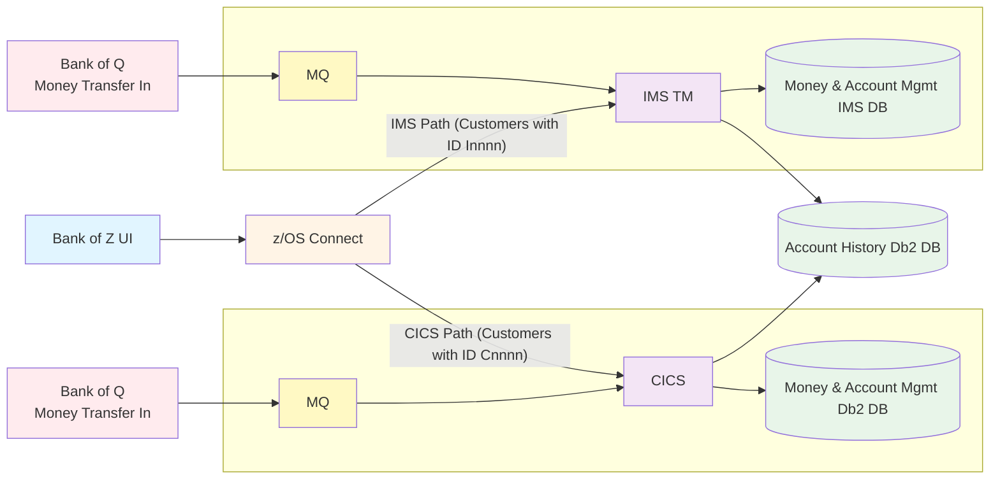

# Bank of Z

## Overview

The Bank of Z provides a modern browser interface to manage a personal bank account. The application is hybrid – it drives IMS transactions that update a Db2 database for some customers and it drives CICS transactions that update the same Db2 database for other customers.

This hybrid application is the result of a merger of two banking systems into one. The Bank of Z UI routes requests based on customer number. In both cases, z/OS Connect enables the client to communicate with the transactional environment.

### Key Components

- **Bank of Z UI**: Modern browser-based interface for customer banking operations
- **z/OS Connect**: Enterprise API gateway enabling communication between the UI and mainframe transaction systems
- **CICS**: Transaction processing system for customers with IDs starting with 'C'
- **IMS TM**: Transaction Manager for customers with IDs starting with 'I'
- **Money and Account Management Db2 DB**: Shared database for account and transaction data
- **Money and Account Management IMS DB**: IMS database for account management
- **Account History Db2 DB**: Database storing historical account information
- **MQ**: Message queuing system for asynchronous communication with external systems
- **Bank of Q Money Transfer In**: External banking system for money transfers

### Application Features

The application provides typical banking operations:

- **Account Management** - Create, update, delete, and inquire on accounts
- **Customer Management** - Manage customer information and profiles
- **Transaction Processing** - Handle debits, credits, and fund transfers
- **Menu Navigation** - User-friendly CICS interface for banking operations

## Architecture




### Customer Routing

- Customers with ID pattern **Cnnnn** → Routed to CICS
- Customers with ID pattern **Innnn** → Routed to IMS TM

## Project Structure

```text
Bank-of-Z/
├── src/                          # Application source code
│   └── base/
│       ├── cobol/               # COBOL programs
│       ├── bms/                 # BMS map definitions
│       └── copy/                # Copybooks
├── .setup/                       # Pipeline setup automation
│   ├── config.yaml              # Environment configuration
│   ├── setup.sh                 # Setup script
│   ├── run_pipeline.sh          # Pipeline execution script
│   ├── pipeline_simulation.sh   # Pipeline simulation script
│   └── build/                   # zBuilder framework
├── .vscode/
│   └── tasks.json               # VS Code custom tasks
├── docs/
│   └── SETUP_GUIDE.md          # Detailed setup instructions
└── dbb-app.yaml                 # DBB application configuration
```

### Build and Deploy Tools

- **COBOL Programs** - Core banking business logic for account management, customer operations, and transactions
- **BMS Maps** - Screen definitions for CICS terminal interactions
- **Copybooks** - Shared data structures and definitions
- **IBM DBB Integration** - Modern build automation for z/OS applications
- **Pipeline Simulation** - Automated build and deployment workflows


## Quick Start

### Prerequisites

**Local Machine:**

- [Java version 21 of IBM's Semeru Runtime](https://developer.ibm.com/languages/java/semeru-runtimes/downloads/)
- [Node.js](https://nodejs.org/) and npm
  - npm: ">=10.9.4 < 10.10.0"
    - `npm -v`
  - node: ">=22.22.1 < 23"
    - `node -v`
- [Zowe CLI](https://docs.zowe.org/stable/user-guide/cli-installcli): 
  - `npm install -g @zowe/cli@zowe-v3-lts`
- Zowe RSE API Plugin: 
  - `zowe plugins install @ibm/rse-api-for-zowe-cli`
- Configured Zowe profile with z/OS connection details

Here is a sample configuration for the Zowe profile. Change:
-  the 'host' line to match your z/OS host
- the 'account' line to match your TSO account on the host
- the 'logonProcedure' line to match your logon procedure on the host

and if you use non-default ports, you may have to change other lines as well.
Save the file in: `~/.zowe/zowe.config.json`
```json
{
  "$schema": "./zowe.schema.json",
  "profiles": {
    "BankOfZDemo": {
      "properties": {
        "host": "<your host>",
        "rejectUnauthorized": false
      },
      "secure": ["user", "password"],
      "profiles": {
        "rseapi": {
          "type": "rse",
          "properties": {
            "port": 8195,
            "basePath": "rseapi",
            "protocol": "https"
          }
        },
        "zosmf": {
          "type": "zosmf",
          "properties": {
            "port": 10443
          }
        },
        "ssh": {
          "type": "ssh",
          "properties": {
            "port": 22
          }
        },
        "tso": {
          "type": "tso",
          "properties": {
            "account": "<account>",
            "codePage": "1047",
            "logonProcedure": "<logon procedure>"
          }
        },        
        "zOpenDebug": {
          "type": "zOpenDebug",
          "properties": {
            "dpsPort": 8192,
            "rdsPort": 8194,
            "dpsContextRoot": "api/v1",
            "dpsSecured": true,
            "authenticationType": "basic",
            "uuid": "4267a0f6-b756-4f3c-b900-0b959b4567c3"
          }
        }
      }
    }
  },
  "defaults": {
    "zosmf": "BankOfZDemo.zosmf",
    "tso": "BankOfZDemo.tso",
    "ssh": "BankOfZDemo.ssh",
    "rse": "BankOfZDemo.rseapi",
    "zOpenDebug": "BankOfZDemo.zOpenDebug"
  },
  "autoStore": true
}
```

You can then test each connection. Example:
- `zowe zosmf check status`
- `zowe rse check status`
- ...

**z/OS System:**

Bank of Z requires a mainframe runtime environment.

- Appropriate permissions for USS directories and dataset creation
- Git installed and available in PATH on USS
- zConfig for provisioning the middleware configuration
  - CICS region for application deployment
- Db2 for z/OS
- IMS 
- IBM DBB 3.0.4.1 installed (typically at `/usr/lpp/IBM/dbb`)
- ZOAU 1.4.1.0 installed (typically at `/usr/lpp/IBM/zoautil`)
- Wazi Deploy 3.0.7.2 installed (typically at `/global/opt/pyenv/gdp`)

### Setup Bank of Z

* Take a fork this repository, or move it into your own git provider
* Follow the initial setup instuctions in [.setup/README.md](.setup/README.md) to install and configure Bank of Z to your own runtime environment.

### Setup IDE

*Using Bob*

Install Bob IDE and required extensions:
- Zowe Explorer
- IBM Z Open Editor
- DB2/CICS/IMS/MQ Extensions

### Build and Install Bank of Z

Building and installing Bank of Z comes with two options. You can either directly clone this repository to Unix System Services, or leverage the configured [VS Code tasks](#using-vs-code-tasks)

#### Option 1: Setup via terminal session

#### Option 2: Using VS Code Tasks

The easiest way to get started is using the built-in VS Code tasks:

1. **Configure Your Environment variables**
   Review [.setup/config/config.yaml](.setup/config/config.yaml) if you want to change the defaults, e.g.

2. **Run Setup Task**

   - Press `Cmd+Shift+P` (macOS) or `Ctrl+Shift+P` (Windows/Linux)
   - Type "Tasks: Run Task"
   - Select **"Setup Pipeline Environment"**
   
   This will:
   - Create workspace directories on USS
   - Clone IBM DBB repository
   - Upload zBuilder framework configurations
   - Install Bank of Z into a new CICS instance.

3. **Run Pipeline Simulation**

   - You must adpat this file before [pipeline_simulation.sh](.setup/pipeline_simulation.sh)  (TODO needs variables)
   - Press `Cmd+Shift+P` (macOS) or `Ctrl+Shift+P` (Windows/Linux)
   - Type "Tasks: Run Task"
   - Select **"Run Pipeline Simulation"**
   - Enter git repository URL and branch when prompted
   
   The pipeline will:
   - Clone your application repository
   - Build all COBOL programs and BMS maps
   - Create load modules
   - Generate build reports

## Tutorials

After setting up Bank of Z in your environment, you can exercise the following developer tasks:

### Development Workflow

1. **Make Changes** - Edit COBOL programs, BMS maps, or copybooks
2. **Commit Changes** - Push to your git repository
3. **Run Pipeline** - Execute via VS Code task or command line
4. **Review Results** - Check build output and load modules
5. **Deploy** - Use generated artifacts for CICS deployment

### Implement Testing practises

## Documentation

- **[Setup Guide](docs/SETUP_GUIDE.md)** - Comprehensive setup instructions, troubleshooting, and customization
- **[Setup Directory README](.setup/README.md)** - Details on setup scripts and configuration
- **[Source Code README](src/README.md)** - Application source code structure

## Troubleshooting

Common issues and solutions:

- **Zowe CLI not found** - Install with `npm install -g @zowe/cli`
- **Connection failed** - Verify Zowe profile: `zowe zosmf check status`
- **Git not available on z/OS** - Contact system administrator to install git
- **Permission denied** - Check USS directory permissions and dataset access

See the [Setup Guide](docs/SETUP_GUIDE.md) for detailed troubleshooting steps.

## Contributing

This is a sample application for demonstration purposes. Feel free to:

- Fork the repository
- Customize for your environment
- Add new features or programs
- Share improvements

## Resources

- [IBM DBB Documentation](https://www.ibm.com/docs/en/dbb)
- [IBM DBB GitHub Repository](https://github.com/IBM/dbb)
- [Zowe CLI Documentation](https://docs.zowe.org/stable/user-guide/cli-using)
- [COBOL Programming Guide](https://www.ibm.com/docs/en/cobol-zos)
- [CICS Documentation](https://www.ibm.com/docs/en/cics-ts)

## License

Licensed under the Apache License, Version 2.0. See [LICENSE](LICENSE) for details.

---

**Getting Started:** Follow the [Setup Guide](docs/SETUP_GUIDE.md) to configure your environment and run your first build.
